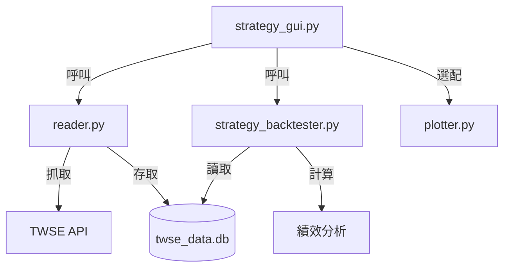

# Backtesting 專案技術文件

本文件詳細說明 Backtesting 專案的核心架構、資料流程及各模組實作細節。

## 1. 系統架構圖 (Mermaid)



## 2. 模組詳解

### 2.1 資料抓取模組 (`reader.py`)
- **功能**：負責與台灣證券交易所開源資料介接。
- **關鍵實作**：
    - `build_trading_days`: 自動解析 TWSE 休市公告，過濾非交易日。
    - `fetch_one_day`: 抓取指定日期的所有股票成交資訊。
    - `bulk_upsert`: 採用 SQLite 批次寫入技術，優化資料庫效能。
- **資料庫 Schema**:
    - 表格名: `ohlcv`
    - 欄位: `日期`, `代號`, `名稱`, `開盤`, `最高`, `最低`, `收盤`, `成交金額`, `資料來源`, `下載時間`

### 2.2 策略回測模組 (`strategy_backtester.py`)
- **功能**：處理技術指標計算與模擬買賣邏輯。
- **支援策略**：
    - **5MA_cross_10MA**: 5日均線穿過10日均線。
    - **MA60_Long**: 站上60日均線且趨勢向上。
    - **Golden_Cross**: 短期均線與長期均線之黃金交叉。
- **報表計算**：自動推算持有 5、10、20、60 天後的價格變動率。

### 2.3 圖形介面模組 (`strategy_gui.py`)
- **功能**：基於 Tkinter 的多分頁主程式。
- **分頁說明**：
    1. **資料管理**：即時顯示下載日誌，支援非同步 (Threading) 下載，避免介面卡頓。
    2. **策略回測**：支援多執行緒掃描、結果列表排序、雙擊查看 K 線圖。
    3. **週線策略**：針對中長線投資者設計的掃描工具。

## 3. 資料夾結構

```text
Test1211/
├── data/               # 存放 SQLite 資料庫與 CSV 快取檔案
├── build/ & dist/      # PyInstaller 打包產生物 (已在 .gitignore 排除)
├── strategy_gui.py     # 主入口
├── reader.py           # 資料層
├── strategy_backtester.py # 邏輯層
├── plotter.py          # 繪圖工具
└── README.md           # 專案快速入門
```

## 4. 常見問題 (Troubleshooting)

- **抓取資料失敗**：請檢查網路連線，或確認 TWSE 是否因為過於频繁的請求而暫時封鎖 IP（系統已內建 Retry 與延遲補償）。
- **找不到資料庫**：初次執行請先點擊「資料管理」執行一次下載，系統會自動建立 `data/twse_data.db`。
